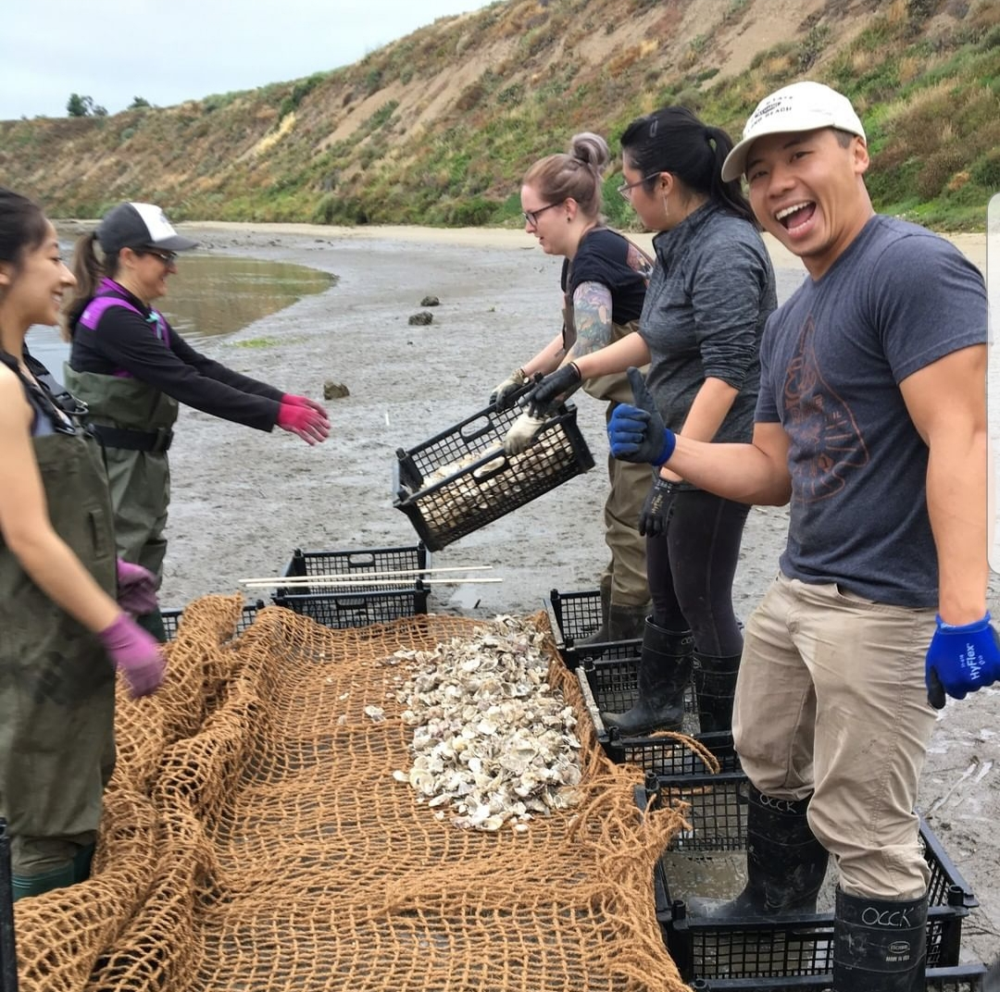

```{r setup, include=FALSE}
knitr::opts_chunk$set(echo = TRUE)

library(tidyverse)
library(knitr)
library(here)
```

## Interests: 

As a student of the Master of Environmental Science and Management (MESM) program at the Bren School of Environmental Science, I am specializing in Conservation Planning (CP) and Water Resources Management (WRM). I aim to learn more about how human interact with natural systems and develop management strategies to best utilize our resources. My career goal is to become a natural resource manager at a state or federal park to help make the right decisions to conserve the beauty of our public lands. Through my success, I hope to inspire communities, such as the Asian American community, to be more active in the management of our resources and the environment. 

## Experiences and Projects

During my undergraduate studies at California State University, Long Beach (majored in Marine Biology and Environmental Science and Policy), I spent a semester on Santa Catalina Island, where I studied marine science and ecology through rigorous courses, daily field work, and independent research. After graduating, I interned with Orange County Coastkeeper to build and monitor oyster and eelgrass beds in Upper Newport harbor through restoration events, scuba diving surveys, and community engagement. I then worked at Point Reyes National Seashore (PRNS) in the Fisheries division, which involved monitoring threatened and endangered fish, such as tidewater gobies, steelhead trout, and coho salmon. Through my time at PRNS, I learned how to set up monitoring equipment (e.g., smolt traps, PIT antennae, DIDSON cameras), performed field surveys, led restoration projects, and implemented a curriculum to teach grade school students about watershed management. 

I am currently expanding my knowledge at the Bren School through wrangling with code, learning about environment in politics, and developing my environmental writing skills. It amazes me that I went from having nearly no coding skills to producing my own website using R!





